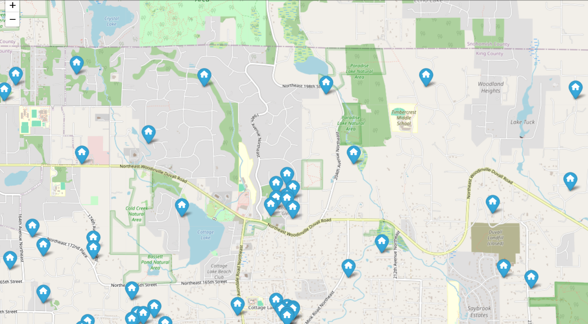

# Нотатки до завдання 1

## Бібліотека **`folium`**

Бібліотека **`folium`** в Python дозволяє створювати інтерактивні мапи на основі **Leaflet.js**. Вона зручна для візуалізації геоданих. 
**Leaflet.js** — це **JavaScript-бібліотека для створення інтерактивних мап у веббраузері**. Вона дуже **легка (≈38 KB)**, **швидка**, і має **простий API**, що робить її однією з найпопулярніших мапових бібліотек у світі.

<aside>
💡

**Reminder:** 
Фраза **"простий API"** означає, що **інтерфейс для роботи з бібліотекою або сервісом легкий для розуміння та використання**, навіть для новачків.
API — це **Application Programming Interface**, тобто набір правил і функцій, які ти можеш викликати для взаємодії з програмою чи бібліотекою.

</aside>

### Створення простої карти:

```sql
import folium

# Створюємо карту з центром у Львові
map = folium.Map(location=[49.8397, 24.0297], zoom_start=13)

# Зберігаємо карту у HTML-файл
map.save("map.html")
```

### Додавання маркерів:

```sql
folium.Marker(
    location=[49.8397, 24.0297],
    popup="Львів, центр міста",
    tooltip="Натисни для деталей"
).add_to(map)
```

### Додавання кругів:

```sql
folium.Circle(
    location=[49.8397, 24.0297],
    radius=500,  # у метрах
    color='blue',
    fill=True,
    fill_color='blue'
).add_to(map)

```

## Створення інтерактивної мапи для моїх даних

**Колонки:**

<aside>
💡

1   date           6710 non-null   object
2   price          6710 non-null   int64

3   bedrooms       6710 non-null   int64

4   bathrooms      6710 non-null   int64

5   sqft_living    6710 non-null   int64

6   sqft_lot       6710 non-null   int64

7   floors         6710 non-null   float64
8   waterfront     6710 non-null   int64

9   view           6710 non-null   int64

10  condition      6710 non-null   int64

11  grade          6710 non-null   int64

12  sqft_above     6710 non-null   int64

13  sqft_basement  6710 non-null   int64

14  yr_built       6710 non-null   int64

15  yr_renovated   6710 non-null   int64

16  zipcode        6710 non-null   int64

17  lat            6710 non-null   float64
18  long           6710 non-null   float64
19  sqft_living15  6710 non-null   int64

20  sqft_lot15     6710 non-null   int64

</aside>

Latitude та Longitude ми використовуємо як координати.

### Створюємо карту з центром

```sql
map_center = [data["lat"].mean(), data["long"].mean()] #середні значення широти та висоти - координати центру
m = folium.Map(location=map_center, zoom_start=10)
```

Параметр `zoom_start` у `folium.Map()` визначає **початковий рівень масштабування мапи**, тобто **наскільки "наближено" або "віддалено" буде видно карту при відкритті**.

**Діапазон значень:**

- Зазвичай від **1** до **18**:
    - `1` — весь світ (максимальне віддалення)
    - `10–13` — **місто або район** (оптимально для нерухомості)
    - `15–18` — **вулиця або квартал**  (максимальне наближення)

### Додаємо маркери для кожного об'єкта:

```python
for _, row in data.iterrows():
    folium.Marker(
        location=[row["lat"], row["long"]],
        popup = f"Ціна: ${row['price']}<br>Спальні: {row['bedrooms']}<br>Площа: {row['sqft_living']} ft²",
        icon=folium.Icon(color="blue",icon="home",  prefix="fa")
    ).add_to(m)
```


