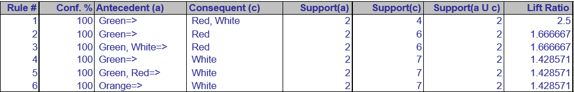

# Нотатки до завдання 3

## Аналіз асоціацій

**Аналіз асоціацій (Association Analysis)** — це метод у Data Mining, який допомагає знаходити **закономірності** між товарами або подіями. Його найчастіше застосовують у **роздрібній торгівлі** для аналізу чеків.

Наприклад:

> Якщо хтось купив хліб і масло, то з великою ймовірністю він купить і молоко.
> 

Data Mining - a process used by companies to turn raw data into useful information.

## Асоціативні правила

Асоціативні правила - це **"якщо-то" правила**, що виражають залежність між товарами

```python
якщо купили {X}, то ймовірно куплять {Y}
```

```python
{хліб, масло} → {молоко}
```

## Основні метрики для оцінки правил

### Support

В ідеалі, ми хочемо створити всі можливі комбінації товарів.

**Проблема:** час обчислення зростає експоненційно в міру зростання кількості товарів

**Рішення:** розглядати лише ті набори товарів, які часто зустрічаються
**Критерій частоти:** *support*  

Метрика Support описує наскільки часто ця комбінація товарів трапляється у всіх транзакціях.

> Наприклад, правило зустрічається у 2% транзакцій → підтримка = 0.02
> 

### **Confidence (достовірність)**

- Ймовірність того, що куплять {Y}, якщо вже купили {X}
- Наприклад: 80% покупців, що купили {X}, купили також {Y}

### **Lift (підсилення)**

- Наскільки сильніше {X} і {Y} трапляються разом, ніж якби були незалежними.
- Lift > 1 = позитивна асоціація, Lift ≈ 1 = випадковість

## Алгоритм Apriori

Це класичний алгоритм для **пошуку частих наборів елементів**.

### Як працює Apriori:

1. **Крок 1:** знаходить всі **часті товари** (наприклад, окремо: хліб, масло, молоко), які з’являються **не менше ніж у 2% чеків**.
2. **Крок 2:** формує комбінації по 2 товари, перевіряє підтримку.
3. **Крок 3:** потім комбінації по 3 товари і далі…
4. Викидає всі набори, які не проходять по порогу підтримки (наприклад, < 2%).
5. Створює **асоціативні правила** з обраних комбінацій.

Це базується на **"принципі апріорності"**:

> Якщо набір з {хліб, масло} не частий, то {хліб, масло, молоко} точно теж не буде частим.
> 

## Приклад таблиці з асоціативними правилами



Ця таблиця містить **асоціативні правила**, які були отримані за допомогою алгоритму, наприклад **Apriori**. 

**Колонки:**

1. **Rule #** — номер правила. Це просто індекс для кожного асоціативного правила у списку.
2. **Conf. % (Confidence)** — **довіра** (confidence) до правила, виражена у відсотках. Це ймовірність того, що якщо відбувається подія **Antecedent (a)** (попередник), то також відбудеться подія **Consequent (c)** (наслідок). 
    
    $$
    \text{Confidence} = \frac{\text{Support}(A \cup C)}{\text{Support}(A)}
    $$
    
    Тобто це співвідношення кількості транзакцій, де одночасно присутні і попередник, і наслідок, до кількості транзакцій, де присутній тільки попередник.
    
3. **Antecedent (a)** — **попередник** правила. Це набір товарів або умов, які повинні бути присутні в транзакції, щоб правило спрацювало. Наприклад, у праві "Green => Red, White", попередник — це "Green" (зелений товар).
4. **Consequent (c)** — **наслідок** правила. Це набір товарів або умов, які повинні з'являтися в транзакції, коли попередник (antecedent) вже є. У тому ж праві "Green => Red, White", наслідок — це "Red" і "White" (червоний і білий товар).
5. **Support(a)** — **підтримка попередника (a)**. Це відсоток транзакцій, у яких присутній попередник (a). Тобто, це частота появи товару або набору товарів, що складають попередник, серед усіх транзакцій.
6. **Support(c)** — **підтримка наслідку (c)**. Це відсоток транзакцій, у яких присутній наслідок (c). Це частота появи товару або набору товарів, що складають наслідок, серед усіх транзакцій.
7. **Support(a U c)** — **підтримка попередника та наслідку разом**. Це відсоток транзакцій, де присутні одночасно і попередник, і наслідок. Іншими словами, це частота того, що і попередник, і наслідок з’являються в одній транзакції.
8. **Lift Ratio** — **коефіцієнт підйому** (lift). Це відношення **спільної підтримки попередника та наслідку** до **підтримки їх окремо**. Коефіцієнт підйому вказує, на скільки ймовірніше, що наслідок з’явиться при наявності попередника в порівнянні з випадковою ймовірністю.
    
    $$
    \text{Lift} = \frac{\text{Support}(A \cup C)}{\text{Support}(A) \times \text{Support}(C)}
    $$
    
    Якщо **Lift > 1**, це означає, що попередник та наслідок з’являються разом частіше, ніж очікувалося за випадковістю, і тому вони є асоційованими. Якщо **Lift < 1**, то це означає, що їх поява разом є меншою за очікувану випадкову ймовірність.