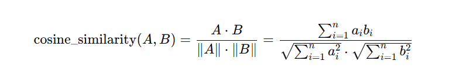

# Нотатки до лабораторної 4

Косинус подібності (англ. **cosine similarity**) — це метрика, яка вимірює **схожість між двома векторами**, обчислюючи **косинус кута між ними**. Її часто використовують в **аналітиці даних**, особливо у завданнях класифікації, пошуку, рекомендаційних системах та обробці природної мови.

---

## Формула косинусної подібності:

Якщо є два вектори:

**A** = (a₁, a₂, ..., aₙ)

**B** = (b₁, b₂, ..., bₙ)

Тоді:

- **Чисельник** — скалярний добуток (dot product) векторів A і B.
- **Знаменник** — добуток їх евклідових норм (довжин).

---

## Значення:

- **1** — вектори максимально подібні (один напрямок).
- **0** — вектори ортогональні (жодної подібності).
- **–1** — вектори мають протилежний напрямок (у текстовій аналітиці зазвичай не зустрічається, бо компоненти не від’ємні).

---

**Часто застосовується у рекомендаційних системах:**

- Вектори можуть представляти вподобання користувачів або властивості продуктів.
- Обчислюємо схожість між користувачами або товарами, щоб дати персоналізовані рекомендації.

## Як працює косинусна подібність у рекомендаціях

Рекомендаційні системи намагаються **передбачити, що саме може сподобатися користувачеві** на основі його попередніх вподобань або подібності до інших користувачів чи товарів.

### Є два основних підходи:

1. **User-based** (заснована на схожості користувачів)
2. **Item-based** (заснована на схожості товарів)

І в обох підходах **косинусна подібність** — ключова метрика.

---

### 1. User-based Collaborative Filtering

**Ідея**: якщо **користувач A подібний до користувача B**, то їм можуть подобатися одні й ті ж товари.

**Матриця вподобань:**

Уявімо, що є така матриця (user–item rating matrix):

|  | Фільм 1 | Фільм 2 | Фільм 3 | Фільм 4 |
| --- | --- | --- | --- | --- |
| Користувач A | 5 | 3 | 0 | 1 |
| Користувач B | 4 | 3 | 0 | 1 |
| Користувач C | 1 | 0 | 4 | 5 |

Щоб передбачити, які фільми рекомендувати користувачу A, можна:

1. Взяти вектори оцінок для A та B:
    
    A = [5, 3, 0, 1],
    
    B = [4, 3, 0, 1]
    
2. Обчислити **косинусну подібність** між A і B → значення буде близьке до 1.
3. Якщо A і B подібні — припускаємо, що те, що подобається B, може сподобатися і A.

---

### 2. Item-based Collaborative Filtering

**Ідея**: якщо **два товари подібні**, то якщо користувачу сподобався один, йому може сподобатися і другий.

Тут порівнюються **вектори оцінок фільмів** від різних користувачів.

Наприклад:

|  | Користувач A | Користувач B | Користувач C |
| --- | --- | --- | --- |
| Фільм 1 | 5 | 4 | 1 |
| Фільм 2 | 3 | 3 | 0 |
- Фільм 1 = [5, 4, 1]
- Фільм 2 = [3, 3, 0]

Обчислюємо косинусну подібність між цими векторами — якщо вони подібні, то фільми "схожі", і можна рекомендувати один, якщо користувачу сподобався інший.