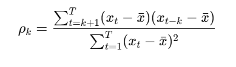

# Нотатки до завдання 9

## Автокореляція

**Лаг (lag)** — це зсув назад у часі на певну кількість кроків.
Приклад:

| Місяць | Значення |
| --- | --- |
| Січень | 100 |
| Лютий | 120 |
| Березень | 130 |
- **Лаг 1** — це значення попереднього місяця:
    - Для березня → лаг 1 = значення за лютий = 120
- **Лаг 2** — це значення за два місяці до поточного:
    - Для березня → лаг 2 = значення за січень = 100

**Автокореляція** показує, наскільки значення часового ряду **пов’язані з попередніми значеннями (лагами)**.

Автокореляція вимірює, чи є **повторювані шаблони** у часі: чи впливає значення на моменті *t* на значення у моменті *t−1, t−2* тощо.

### Формула автокореляції на лагу *k*:




## Часткова автокореляція

**Часткова автокореляція** вимірює **зв’язок між значенням у моменті *t* і *t−k***, **виключаючи вплив усіх проміжних лагів** (*t−1, t−2,..., t−k+1*).

| Функція | Що вимірює | Коли використовувати |
| --- | --- | --- |
| **ACF** | Загальний зв’язок з попередніми лагами | Щоб побачити, на яких лагах є залежність |
| **PACF** | Чистий (частковий) зв’язок із певним лагом | Щоб знайти **максимальний лаг для AR-моделі** |

Щоб знайти часткову автокореляцію на лагу k, будують дві регресії:


## Автокореляції у Python

```python
data.set_index("DATE", inplace=True)

# Обираємо стовпець, який нас цікавить (наприклад, рівень індексу)
series = data["IPG2211A2N"]

# Автокореляційна функція
plot_acf(series, lags=24)
plt.title("Автокореляційна функція (ACF)")
plt.xlabel("Лаг (місяці)")
plt.ylabel("Коефіцієнт кореляції")
plt.grid(True)
plt.show()

# Часткова автокореляційна функція
plot_pacf(series, lags=24, method='ywm')
plt.title("Часткова автокореляційна функція (PACF)")
plt.xlabel("Лаг (місяці)")
plt.ylabel("Часткова кореляція")
plt.grid(True)
plt.show()
```

## Модель ARIMA

ARIMA — це модель для часових рядів, яка дозволяє **прогнозувати майбутні значення** на основі минулих.

ARIMA  має три параметри:

**ARIMA(p, d, q)**

### **p — порядок авторегресії (AR)**

Параметр p дивимось з Часткової функції автокореляції

Графік показує **який саме лаг напряму впливає на поточне значення**, після врахування всіх попередніх.

**Як читати PACF**:

- По осі X — лаги (затримки): 1, 2, 3…
- По осі Y — часткова автокореляція
- Є **дві сині горизонтальні лінії** — це **довірчий інтервал** (як правило, ±1.96/√n)
- **Все, що стирчить за межі синіх ліній** — значущі лаги

**Перший лаг, після якого стовпчики вже незначущі** — це і є хороше `p`.

### **d — порядок диференціювання (щоб зробити ряд стаціонарним)**

- Подивись на графік часового ряду.
- Якщо він має **тренд або змінну дисперсію** → треба взяти **першу різницю** (тобто `d = 1`).
- Якщо після `diff()` ряд виглядає стаціонарним (без тренду, навколо середнього) → добре.

### **q — порядок рухомого середнього (MA)**

q дивимося по функції автокореляції

Графік показує **зв'язок між значенням ряду та його лагами без урахування інших лагів**.

- Шукаєш, після якого лагу **стовпчики перестають виходити за межі** синіх ліній
- Це буде хороше значення для `q`

### Інтуїтивне пояснення моделі

ARIMA намагається знайти **закономірності** у даних:

- Як значення залежить від **попередніх значень** (авторегресія – AR)
- Як значення змінюється з часом (диференціювання – I)
- Як враховувати **помилки попередніх прогнозів** (MA)

### **Наш приклад:**

Аналізуємо **місячну динаміку індексу промислового виробництва (IPG2211A2N)**. 

За допомогою ARIMA:

- можна зрозуміти тенденції,
- виявити сезонність або спади,
- **спрогнозувати, яким буде індекс у наступні місяці**, якщо все триватиме з тією ж динамікою.
